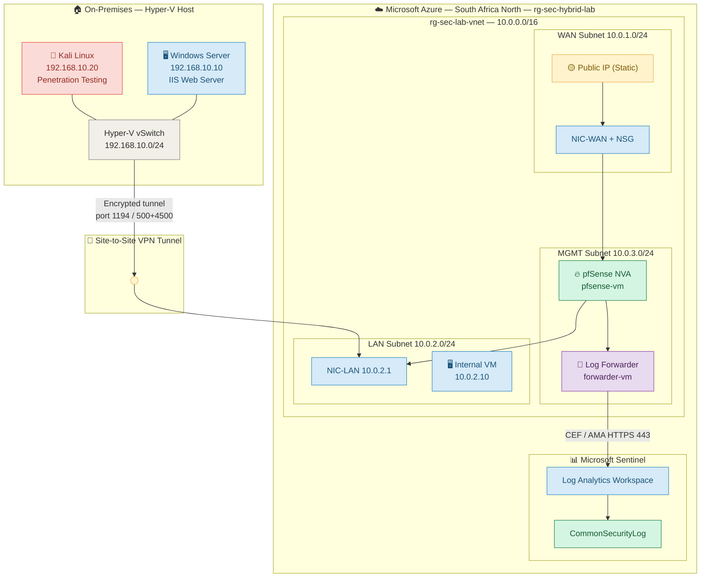

# 🛡️ Hybrid Security Lab — rg-sec-hybrid-lab

> **Status: 🟢 Active Build** — Last updated: 2026  
> This is a live, ongoing portfolio lab. New phases, fixes, and findings are added continuously.


[← Back to Labs Index](../README.md) · [← Back to Main Index](../../README.md)

---

## 🎯 Lab Objective

This lab is a **hybrid cloud/on-premises security environment** built to mirror the real-world infrastructure managed by a Managed Service Provider (MSP). It demonstrates practical skills in network segmentation, firewall policy management, SIEM integration, VPN connectivity, and intrusion detection — all documented as reproducible Infrastructure-as-Code.

**Career context:** This lab is the primary portfolio piece supporting my transition from **Cloud Security Analyst → Network Security Engineer**.

---

## 🗺️ Lab Architecture



---

## 🔬 Tech Stack

| Layer | Technology | Purpose |
|---|---|---|
| Cloud Platform | Microsoft Azure (South Africa North) | Hosting all cloud resources |
| Firewall / NVA | pfSense CE / Plus | Stateful firewall, VPN endpoint, IDS/IPS |
| IDS / IPS | Snort (pfSense package) | Signature-based intrusion detection |
| SIEM | Microsoft Sentinel | Log aggregation, analytics, alerting |
| Log Transport | rsyslog + Azure Monitor Agent (AMA) | CEF log forwarding to Sentinel |
| On-Prem Virtualisation | Hyper-V | Simulated on-premises environment |
| Attack Platform | Kali Linux | Penetration testing and traffic generation |
| Target Server | Windows Server + IIS | Simulated production workload |
| IaC / Automation | Azure CLI + PowerShell | Reproducible deployments |

---

## 📁 Repository Structure

```
rg-sec-hybrid-lab/
├── README.md                              ← You are here
├── phases/
│   ├── phase1-azure-backbone.md           ← VNet, Subnets, pfSense NVA, UDRs
│   ├── phase2-sentinel-pipeline.md        ← Log forwarder, AMA, CEF, KQL
│   ├── phase3-hybrid-vpn.md               ← Site-to-Site VPN (Hyper-V ↔ Azure)
│   └── phase4-ids-snort.md                ← Snort IDS/IPS (in progress)
├── kql/
│   ├── blocked-traffic.kql
│   ├── vpn-auth-failures.kql
│   └── ids-alerts.kql
├── scripts/
│   ├── deploy-backbone.sh
│   ├── deploy-forwarder.sh
│   └── deploy-vpn.sh
└── troubleshooting/
    └── break-fix-ledger.md
```

---

## 🚦 Build Progress

| Phase | Description | Status | Guide |
|---|---|---|---|
| **Phase 1** | Azure Backbone — VNet, Subnets, pfSense NVA, UDRs | ✅ Complete | [View →](phases/phase1-azure-backbone.md) |
| **Phase 2** | Sentinel Pipeline — rsyslog, AMA, CEF, KQL | ✅ Complete | [View →](phases/phase2-sentinel-pipeline.md) |
| **Phase 3** | Hybrid VPN — Site-to-Site IPsec / OpenVPN | ✅ Complete | [View →](phases/phase3-hybrid-vpn.md) |
| **Phase 4** | IDS/IPS — Snort on pfSense | 🔄 In Progress | [View →](phases/phase4-ids-snort.md) |
| **Phase 5** | Threat Simulation — Kali vs IIS | 🔜 Planned | Coming soon |
| **Phase 6** | Sentinel Workbook and Analytics Rules | 🔜 Planned | Coming soon |

---

## 💡 Key Skills Demonstrated

| Skill | Where Applied |
|---|---|
| Network segmentation (WAN / LAN / MGMT) | Phase 1 — subnet design |
| Stateful firewall policy (pfSense) | Phase 1 — firewall rules |
| Azure IP Forwarding + User Defined Routes | Phase 1 — NVA routing |
| SIEM log pipeline (CEF via AMA) | Phase 2 — Sentinel integration |
| KQL threat hunting | Phase 2 — blocked traffic, VPN failures, IDS |
| Site-to-Site VPN (IPsec) | Phase 3 — hybrid connectivity |
| Intrusion Detection (Snort) | Phase 4 — IDS/IPS |
| Infrastructure-as-Code (Azure CLI) | All phases |
| Break/Fix documentation | Troubleshooting Ledger |

---

## 📊 Budget Tracking (R1,500/month target)

| Resource | SKU | Est. Monthly Cost (ZAR) |
|---|---|---|
| pfSense NVA VM | Standard_B2s | ~R650 |
| Log Forwarder VM | Standard_B2s | ~R650 |
| Internal Test VM | Standard_B1s | ~R200 |
| Log Analytics (low vol.) | Pay-as-you-go | ~R100–R200 |
| Microsoft Sentinel | First 31 days free | R0 (lab) |
| Public IP (Static) | Standard | ~R40 |
| **Total Estimate** | | **~R1,640–R1,740** |

> 💰 All VMs are **deallocated when not in use** to stay within budget. Only managed disk storage is billed when deallocated.

```bash
# Deallocate to save cost
az vm deallocate --resource-group rg-sec-hybrid-lab --name pfsense-vm
az vm deallocate --resource-group rg-sec-hybrid-lab --name forwarder-vm

# Start when resuming lab work
az vm start --resource-group rg-sec-hybrid-lab --name pfsense-vm
az vm start --resource-group rg-sec-hybrid-lab --name forwarder-vm
```

---

*Built by Matome Samson Letsoalo — Cloud Security Analyst → Network Security Engineer.*  
*All configurations are reproducible via the scripts in the `scripts/` folder.*
